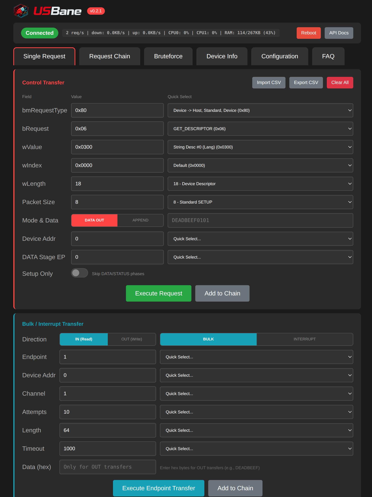
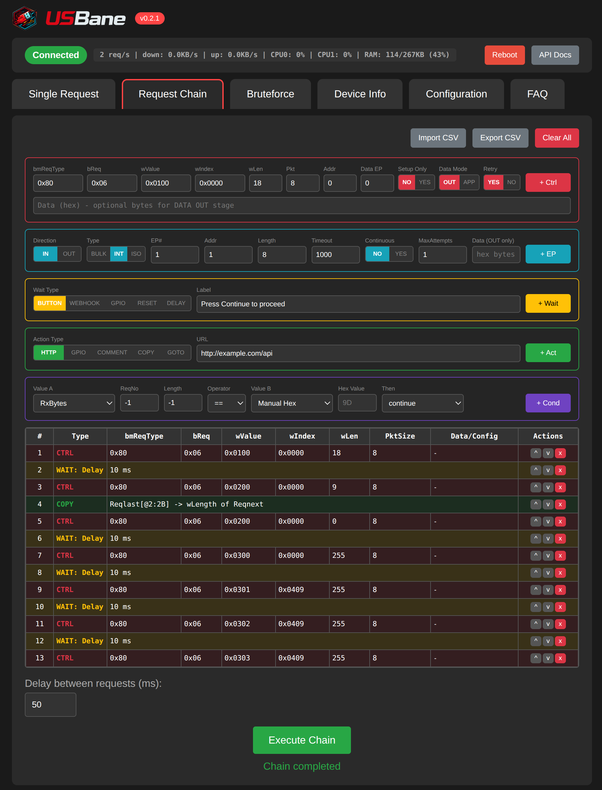
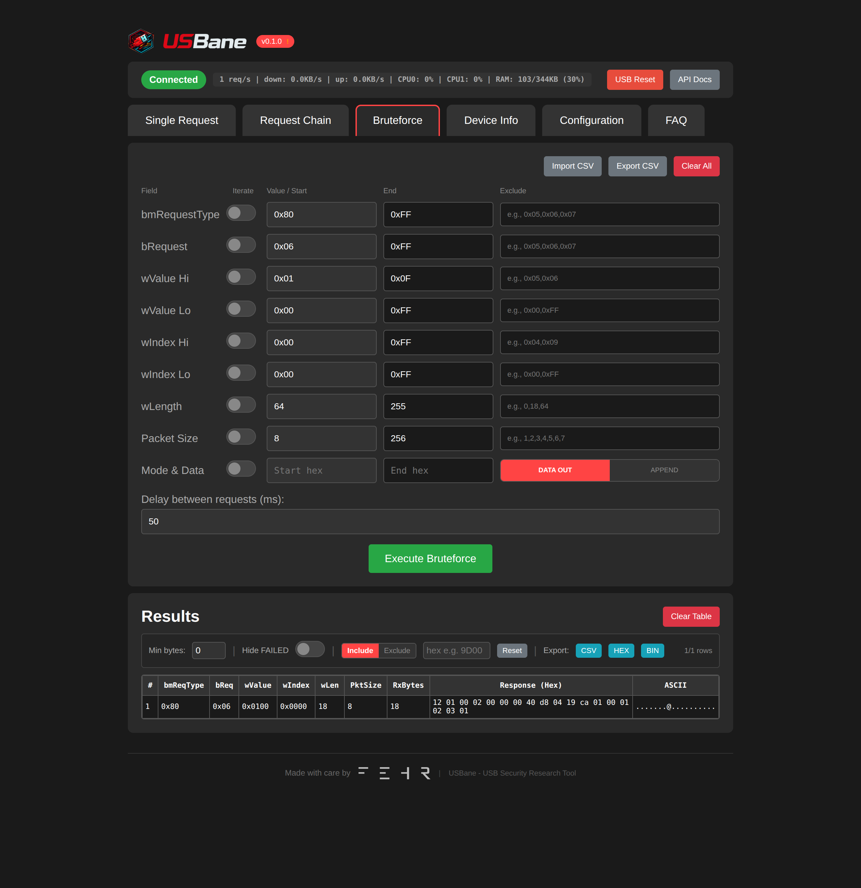
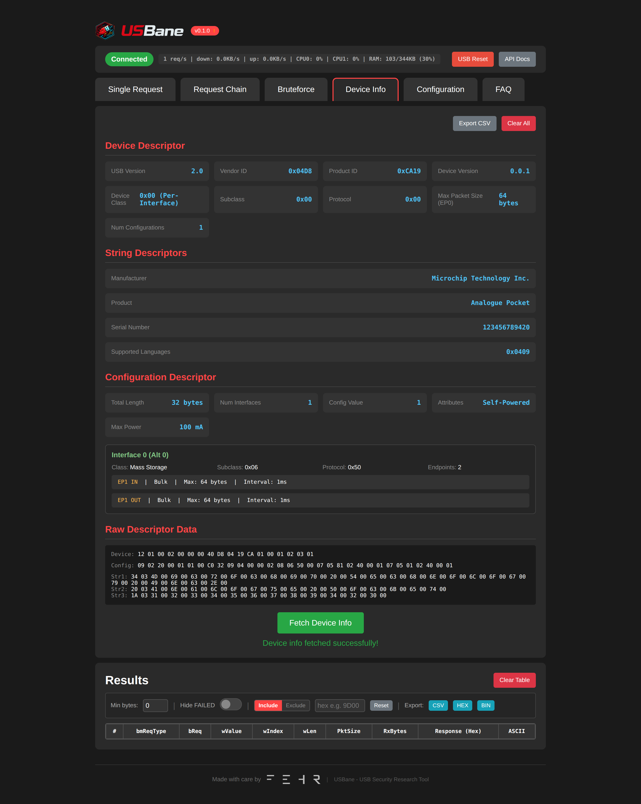

<p align="center">
  
  
</p>

[](https://github.com/Fehr-GmbH/USBane/actions/workflows/build.yml)
[](https://www.gnu.org/licenses/gpl-3.0)
[](https://www.espressif.com/en/products/socs/esp32-s3)
[](https://github.com/espressif/esp-idf)
[](https://github.com/Fehr-GmbH/USBane/releases)

<p align="center"><b>USB Security Research Tool for ESP32-S3</b></p>

USBane is an open-source USB security research framework that enables direct hardware access to the DWC2 USB controller on ESP32-S3, bypassing standard USB stack validation for security testing and vulnerability research.

## Screenshots

<p align="center">
  <a href="sample_images/1.png"></a>
  <a href="sample_images/2.png"></a>
</p>
<p align="center">
  <a href="sample_images/3.png"></a>
  <a href="sample_images/4.png"></a>
</p>

## Features

- **Direct USB Hardware Access** - Bypasses ESP-IDF USB Host stack for low-level control
- **Web Interface** - Real-time control via browser (WiFi AP or Client mode)
- **REST API with OpenAPI Documentation** - Full API documentation with Swagger UI for scripting and automation
- **Dual-Core Architecture** - Core 0 handles WiFi/HTTP, Core 1 runs unified USB executor
- **Unified USB Executor** - Single endpoint handles control, bulk, and interrupt transfers
- **Malformed Packet Support** - Send truncated, oversized, or custom USB packets
- **Bulk/Interrupt Endpoint Transfers** - Read/write any endpoint (EP1-15) with:
  - **Configurable Host Channel** - Use separate USB channels (0-15) for parallel operations
  - **Continuous Read Mode** - Polling reads with configurable max attempts
  - **Bulk and Interrupt Types** - Full support for non-control transfers
- **Advanced Request Chains** - Powerful automation with:
  - **Wait Conditions**: Button prompts, webhooks, GPIO triggers, USB resets, delays
  - **Actions**: HTTP calls, GPIO control, comments, dynamic data copying, GOTO jumps
  - **Conditionals**: Compare responses with operators (==, !=, <, >, <=, >=, contains), skip steps or break execution
  - **Dynamic Data**: Copy response bytes between requests, reference previous results
  - **Endpoint Transfers**: Chain bulk/interrupt IN/OUT operations alongside control transfers
- **Bruteforce Mode** - Iterate through parameter ranges with exclude lists and retry logic
- **Device Info** - Automatic USB descriptor parsing and display
- **Import/Export** - CSV support for sharing configurations and request chains
- **Real-time Monitoring** - Live USB statistics, CPU load, heap usage
- **Automatic Updates** - GitHub release version checking (when connected to internet)
- **Factory Reset** - One-click restore to default settings

## Hardware Requirements

- ESP32-S3 development board with USB OTG support
- **Minimum 8MB flash** recommended (supports OTA updates)
- USB OTG cable/adapter for connecting target devices
- Target USB device for testing
- (Optional) GPIO pins for hardware triggers/control

### Recommended Board

[**Freenove ESP32-S3-WROOM**](https://store.freenove.com/products/fnk0085)

## Quick Start

### Prerequisites
- ESP-IDF v5.x installed and configured
- ESP32-S3 board with 8MB+ flash

### Build and Flash

```bash
# Set target
idf.py set-target esp32s3

# Build (flash size configured in sdkconfig.defaults)
idf.py build

# Flash to device
idf.py flash

# (Optional) Monitor serial output
idf.py monitor
```

### Connect and Access

1. **Connect to WiFi**
   - SSID: `USBane`
   - Password: `usbane123`

2. **Open Web Interface**
   - Navigate to `http://192.168.4.1`
   - Or use Client Mode to connect to your network

## Web Interface

| Tab | Description |
|-----|-------------|
| Single Request | Send USB control transfers (EP0) and bulk/interrupt transfers (EP1-15) |
| Request Chain | Execute automated sequences with wait conditions, actions, and flow control |
| Bruteforce | Iterate through parameter ranges with filtering and retry logic |
| Device Info | View and parse USB device, configuration, and string descriptors |
| Configuration | WiFi modes, USB PHY settings, retry behavior, factory reset |
| FAQ | Comprehensive usage documentation and examples |

### Single Request Tab

The Single Request tab provides two transfer modes:

- **Control Transfer (EP0)** - Standard SETUP packets with custom bmRequestType, bRequest, wValue, wIndex, wLength
- **Bulk/Interrupt Transfer (EP1-15)** - Direct endpoint access with:
  - Direction: IN (read) / OUT (write)
  - Type: Bulk or Interrupt
  - Configurable endpoint, device address, host channel
  - Continuous mode with max attempts for polling reads

Access the main interface at: `http://192.168.4.1/` (default AP mode)

## API Documentation

Interactive API documentation with OpenAPI/Swagger UI is available at: `http://192.168.4.1/api`

The REST API enables:
- **Scriptable attacks** - Automate USB fuzzing campaigns with Python, curl, or any HTTP client
- **Integration** - Connect USBane with security testing frameworks and CI/CD pipelines
- **Programmatic control** - Send USB requests, configure settings, manage chains via HTTP
- **Remote monitoring** - Query device status, statistics, and results

### Unified `/api/single_request` Endpoint

All USB transfers (control, bulk, interrupt) use a single endpoint with a `type` parameter:

```bash
# Control transfer (default)
curl -X POST "http://192.168.4.1/api/single_request?type=control&bmRequestType=0x80&bRequest=0x06&wValue=0x0100&wIndex=0x00&wLength=18"

# Bulk IN from endpoint 1
curl -X POST "http://192.168.4.1/api/single_request?type=bulk_in&ep=1&len=64&addr=0&timeout=1000"

# Bulk OUT to endpoint 1
curl -X POST "http://192.168.4.1/api/single_request?type=bulk_out&ep=1&data=DEADBEEF&addr=0"

# Interrupt IN with continuous polling
curl -X POST "http://192.168.4.1/api/single_request?type=interrupt_in&ep=1&len=8&continuous=1&max_attempts=10"

# Interrupt OUT
curl -X POST "http://192.168.4.1/api/single_request?type=interrupt_out&ep=1&data=01020304"
```

### Chain and Bruteforce Execution

```bash
# Execute a chain (POST CSV body)
curl -X POST "http://192.168.4.1/api/chain" \
  -H "Content-Type: text/csv" \
  --data-binary @my_chain.csv

# Execute bruteforce (POST CSV config - same format as UI export)
curl -X POST "http://192.168.4.1/api/bruteforce" \
  -H "Content-Type: text/csv" \
  --data-binary @bruteforce_config.csv
```

### Other API Endpoints

```bash
# Get device status
curl "http://192.168.4.1/api/status"

# Reset USB device
curl -X POST "http://192.168.4.1/api/reset"

# Get device descriptors
curl "http://192.168.4.1/api/device_info"
```

See `/api` for complete endpoint documentation with interactive testing.

## Configuration

### WiFi Modes
- **Access Point** (default): ESP32 creates its own network
- **Client Mode**: Connect to existing router (fallback AP always available)

### USB Settings
- USB Speed: Full-Speed (12 Mbps) or Low-Speed (1.5 Mbps)
- Device Address, Endpoint, Max Packet Size configurable

## Request Chain Capabilities

Request chains enable complex automation scenarios with powerful flow control:

### Wait Types
- **Button** - Pause for manual user confirmation
- **Webhook** - Wait for external HTTP trigger
- **GPIO** - Wait for hardware signal (pin goes HIGH/LOW)
- **USB Reset** - Reset USB device state
- **Delay** - Fixed time delay (milliseconds)

### Actions
- **HTTP** - Call external APIs or webhooks
- **GPIO Output** - Control hardware pins
- **Comment** - Add documentation to chain execution
- **Copy** - Extract data from responses and inject into subsequent requests
- **GoTo** - Jump to specific chain index for loops
- **Endpoint IN/OUT** - Bulk/interrupt transfers to any endpoint (EP1-15)

### Conditionals
- **Operators**: `==`, `!=`, `<`, `>`, `<=`, `>=`, `contains`
- **Sources**: Compare received bytes, response hex data, or manual values
- **Outcomes**: Continue, skip next step, or break execution
- **Use Cases**: Error handling, adaptive fuzzing, state validation

### Example Use Cases
- Enumerate descriptors with dynamic length extraction
- Implement retry logic with conditional breaks
- Create feedback loops for iterative testing
- Automate multi-stage exploitation chains
- Validate device responses before proceeding

## CSV Chain Format

Request chains can be imported/exported as CSV files for sharing and version control.

### Row Types

| Type | Description |
|------|-------------|
| `control` | USB Control Transfer (EP0 SETUP packet) |
| `bulk_in` | Bulk IN transfer (EP1-15) |
| `bulk_out` | Bulk OUT transfer (EP1-15) |
| `interrupt_in` | Interrupt IN transfer (EP1-15) |
| `interrupt_out` | Interrupt OUT transfer (EP1-15) |
| `waitfor` | Wait condition (button, webhook, GPIO, delay, USB reset) |
| `action` | Action (HTTP, GPIO output, comment, copy, goto) |
| `condition` | Conditional logic (if/then comparisons) |

### Control Transfer Format

```csv
control,bmRequestType,bRequest,wValue,wIndex,wLength,packetSize,dataMode,dataBytes,deviceAddr,flags
```

| Field | Description | Example |
|-------|-------------|---------|
| `bmRequestType` | Request type bitmap | `0x80` (Device-to-Host) |
| `bRequest` | Request code | `0x06` (GET_DESCRIPTOR) |
| `wValue` | Request value | `0x0100` (Device Descriptor) |
| `wIndex` | Request index | `0x0000` |
| `wLength` | Expected response length | `18` |
| `packetSize` | SETUP packet size (8=normal, >8=oversized) | `8` |
| `dataMode` | `separate` (DATA OUT stage) or `append` (oversized SETUP) | `separate` |
| `dataBytes` | Hex data for OUT transfers | `DEADBEEF` |
| `deviceAddr` | USB device address (0=enumeration, 1-127=assigned) | `0` |
| `flags` | Comma-separated: `noretry`, `setuponly`, `ep10` (dataStageEp=10) | `noretry` |

### Bulk/Interrupt Transfer Formats

```csv
# Bulk IN
bulk_in,endpoint,length,deviceAddr,timeout,continuous,maxAttempts

# Bulk OUT
bulk_out,endpoint,dataBytes,deviceAddr,timeout

# Interrupt IN
interrupt_in,endpoint,length,deviceAddr,timeout,continuous,maxAttempts

# Interrupt OUT
interrupt_out,endpoint,dataBytes,deviceAddr,timeout
```

| Field | Description | Example |
|-------|-------------|---------|
| `endpoint` | Endpoint number (1-15) | `10` |
| `length` | Bytes to read (IN only) | `64` |
| `deviceAddr` | USB device address | `1` |
| `timeout` | Timeout in milliseconds | `1000` |
| `continuous` | Polling mode: `1`/`0` | `0` |
| `maxAttempts` | Max attempts for continuous mode | `10` |
| `dataBytes` | Hex data (OUT only) | `AABBCCDD` |

### Wait Conditions

```csv
waitfor,button,label
waitfor,webhook,triggerId,timeout
waitfor,gpio,pin,level,timeout
waitfor,delay,duration
waitfor,usb_reset,note
```

### Actions

```csv
action,http,url
action,gpio_out,pin,level
action,comment,text
action,copy,source,fromReqNo,fromOffset,fromLength,toField,toReqNo
action,goto,targetIndex
```

**Copy Action Fields**:
| Field | Description | Example |
|-------|-------------|---------|
| `source` | Source of data: `responsehex` (response bytes) or `rxbytes` (byte count) | `responsehex` |
| `fromReqNo` | Source request index (-1 = last executed) | `-1` |
| `fromOffset` | Byte offset in source data | `2` |
| `fromLength` | Bytes to copy (-1 = all from offset) | `2` |
| `toField` | Target field: `wLength`, `wValue`, `wIndex`, `dataBytes`, etc. | `wLength` |
| `toReqNo` | Target request index (-1 = next request) | `-1` |

Note: Numeric fields (`wLength`, `wValue`, `wIndex`, etc.) are automatically converted from little-endian byte order.

### Conditions

```csv
condition,valueASource,valueAReqNo,valueALength,operator,valueBSource,valueBValue,action
```

### Example Chain CSV

```csv
# Get Device Descriptor at address 0
control,0x80,0x06,0x0100,0x0000,18,8,separate,,0,

# SET_ADDRESS to assign address 1
control,0x00,0x05,0x0001,0x0000,0,8,separate,,0,
waitfor,delay,50

# Get Config Descriptor header at address 1
control,0x80,0x06,0x0200,0x0000,9,8,separate,,1,

# Copy wTotalLength (bytes 2-3, little-endian) to wLength of next request
action,copy,responsehex,-1,2,2,wLength,-1

# Get full Config Descriptor with dynamic length
control,0x80,0x06,0x0200,0x0000,0,8,separate,,1,

# Read from interrupt endpoint 10
interrupt_in,10,64,1,1000,0,1

# Check if we got data
condition,rxbytes,-1,-1,>,manual,0,continue
action,comment,Device enumerated successfully
```

## Project Structure

```
├── main/
│   ├── html/              # Web interface files
│   │   ├── index.html     # Main UI
│   │   ├── app.js         # UI logic and WebSocket client
│   │   ├── api.html       # API documentation UI (Swagger)
│   │   ├── openapi.json   # OpenAPI specification
│   │   ├── applogo.png    # Application logo
│   │   ├── apptext.svg    # Application text logo
│   │   ├── favicon.ico    # Browser favicon
│   │   └── logo.svg       # SVG logo
│   ├── main.c             # Application entry point
│   ├── usbane.c/.h        # USB backend router (Core 1)
│   ├── dwc2_backend.c/.h  # DWC2 hardware USB controller
│   ├── soft_backend.c/.h  # GPIO bit-bang USB (WIP)
│   ├── chain_engine.c/.h  # Chain/bruteforce executor (Core 1)
│   ├── web_interface.c/.h # HTTP/WebSocket server (Core 0)
│   └── wifi_ap.c/.h       # WiFi AP/STA management
├── chains/                # Example chain CSV files
├── sample_images/         # Application screenshots
├── applogo.png            # High-res logo for README
├── apptext.svg            # Logo text for README
├── LIMITATIONS.md         # Known issues with GPIO bit-bang backend
├── CMakeLists.txt
├── sdkconfig.defaults
└── COPYING
```

## Disclaimer

⚠️ **This tool is intended for security research, education, and authorized testing only.**

- Only use on devices you own or have explicit permission to test
- Users are responsible for complying with all applicable laws and regulations
- The authors are not responsible for any misuse or damage caused by this tool
- Some USB operations may cause device malfunction or data loss

## License

Copyright 2026 [Fehr GmbH](https://fe.hr)

This program is free software: you can redistribute it and/or modify it under the terms of the GNU General Public License as published by the Free Software Foundation, either version 3 of the License, or (at your option) any later version.

See [COPYING](COPYING) for the full license text.

## Contributing

Contributions are welcome! Please ensure your code follows the existing style and includes appropriate documentation.

## Links

- **Website**: [https://fe.hr](https://fe.hr)
- **Issues**: Report bugs and feature requests via GitHub Issues
